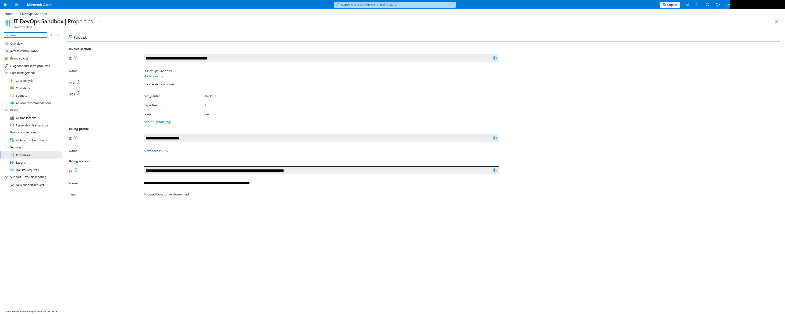

# Create a single invoice section with custom display name and tags

This example creates a single invoice section with a custom display name a a set of tags.



## Usage

Set the following variables:

- `billing_account_id` - Id of the MCA billing account.
- `billing_profile_id` - Id of the billing profile attached to `var.billing_account_id`.

Then run the following commands to deploy the export:

```bash
# Init Terraform
terraform init

# Plan changes
terraform plan

# Apply
terraform apply
```

## Main code

```hcl
module "invoice_section" {
  source = "../.."

  billing_account_id = var.billing_account_id
  billing_profile_id = var.billing_profile_id

  sections = {
    it-devops-sandbox = {
      name         = "it-devops-sandbox"
      display_name = "IT DevOps Sandbox"
      tags = {
        department  = "it"
        team        = "devops"
        cost_center = "86-3133"
      }
    }
  }
}
```

You can then retrieve the invoice section id from Terraform module's output:

```
# Invoice section Id
module.invoice_section.invoice_sections.id
```

<!-- BEGIN_TF_DOCS -->
## Requirements

| Name | Version |
| ---- | ------- |
| <a name="requirement_terraform"></a> [terraform](#requirement\_terraform) | ~> 1.8 |
| <a name="requirement_azapi"></a> [azapi](#requirement\_azapi) | ~> 2.10 |

## Providers

No providers.

## Modules

| Name | Source | Version |
| ---- | ------ | ------- |
| <a name="module_invoice_section"></a> [invoice\_section](#module\_invoice\_section) | ../.. | n/a |

## Resources

No resources.

## Inputs

| Name | Description | Type | Default | Required |
| ---- | ----------- | ---- | ------- | :------: |
| <a name="input_billing_account_id"></a> [billing\_account\_id](#input\_billing\_account\_id) | Id of the MCA billing account.<br/><br/>  Id can be found via the Azure Portal (portal.azure.com) via "Cost Management + Billing > Billing scopes > Select your MCA > Settings > Properties > Billing account id".<br/><br/>  Examples:<br/><br/>  - `00000000-0000-5000-3000-000000000000:00000000-0000-4000-0000-000000000000_2019-05-31` | `string` | n/a | yes |
| <a name="input_billing_profile_id"></a> [billing\_profile\_id](#input\_billing\_profile\_id) | Id of the billing profile attached to `var.billing_account_id`.<br/><br/>  Id can be found via the Azure Portal (portal.azure.com) via "Cost Management + Billing > Billing scopes > Select your MCA > Billing > Billing profiles > Select your Billing profile > Settings > Properties > Billing profile ID".<br/><br/>  Examples:<br/><br/>  - `0000-0000-000-000`<br/>  - `00000000-0000-4000-0000-000000000000` | `string` | n/a | yes |

## Outputs

| Name | Description |
| ---- | ----------- |
| <a name="output_invoice_sections"></a> [invoice\_sections](#output\_invoice\_sections) | Informations about the invoice section created in the module. |
<!-- END_TF_DOCS -->
